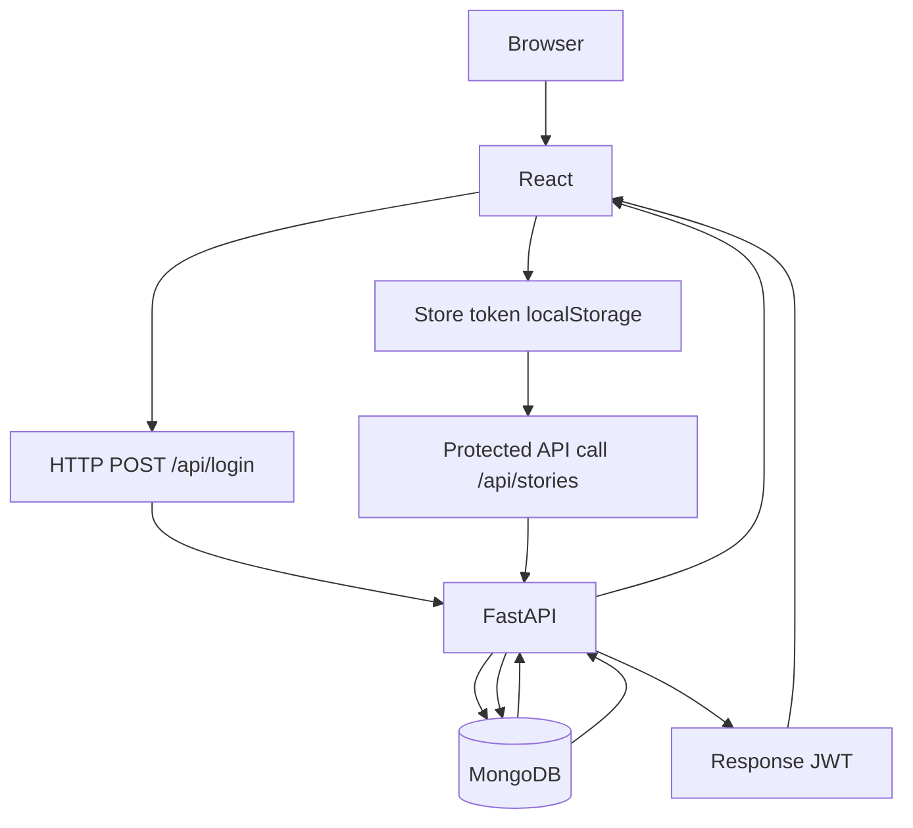

# Intern Story App (React + FastAPI + MongoDB)

A simple teaching project for interns to understand end-to-end flow:

`React frontend -> FastAPI backend -> MongoDB`

## Features

- User registration (`POST /api/register`)
- Login with JWT (`POST /api/login`)
- Protected routes in frontend (`/stories`, `/stories/:id`)
- Protected APIs with FastAPI dependency (`get_current_user`)
- Story create/list/detail/edit
- User-isolated stories (you only see your own stories)
- Logout by clearing token from localStorage

## Tech Stack

- Frontend: React (Vite), React Router, `fetch`
- Backend: FastAPI, `pymongo`, `python-jose`, `passlib`
- Database: MongoDB in Docker Compose

## Project Structure

```text
React_FullStack_App/
├── .env.example
├── docker-compose.yml
├── README.md
├── backend/
│   ├── main.py
│   └── requirements.txt
├── frontend/
│   ├── .env.example
│   ├── index.html
│   ├── package.json
│   ├── vite.config.js
│   └── src/
│       ├── App.jsx
│       ├── api.js
│       ├── main.jsx
│       ├── styles.css
│       ├── components/
│       │   └── ProtectedRoute.jsx
│       └── pages/
│           ├── LoginPage.jsx
│           ├── RegisterPage.jsx
│           ├── StoriesPage.jsx
│           └── StoryDetailPage.jsx
└── docs/
    ├── RUNBOOK.md
    └── TEACHING_SCRIPT_60_MIN.md
```

## API Endpoints

- `POST /api/register`
- `POST /api/login`
- `GET /api/me`
- `GET /api/stories`
- `POST /api/stories`
- `GET /api/stories/{id}`
- `PUT /api/stories/{id}`
- `GET /health`

## Run and Teach Docs

- Full runbook (fresh machine commands): [docs/RUNBOOK.md](docs/RUNBOOK.md)
- 60-minute intern teaching script: [docs/TEACHING_SCRIPT_60_MIN.md](docs/TEACHING_SCRIPT_60_MIN.md)

## Solution Architecure



## Quick Start

1. Start Mongo:

```bash
docker compose up -d mongo
```

2. Backend:

```bash
cp .env.example .env
python3 -m venv .venv
source .venv/bin/activate
pip install -r backend/requirements.txt
uvicorn backend.main:app --reload --host 0.0.0.0 --port 8000 --reload-dir backend
```

3. Frontend (new terminal):

```bash
cp frontend/.env.example frontend/.env.local
cd frontend
npm install
npm run dev -- --host 0.0.0.0 --port 5173
```

4. Open:
- Frontend: `http://localhost:5173`
- Backend docs: `http://localhost:8000/docs`

## Notes

- Project keeps auth intentionally simple for learning.
- JWT is stored in localStorage (not ideal for production).
- For production, use enterprise SSO and stronger session/token controls.

